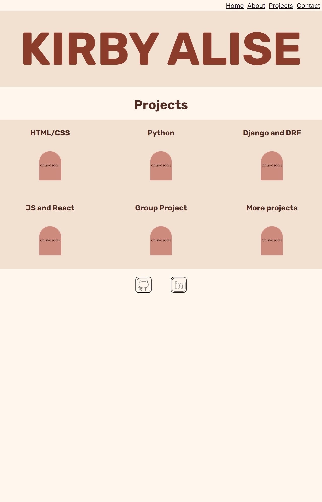
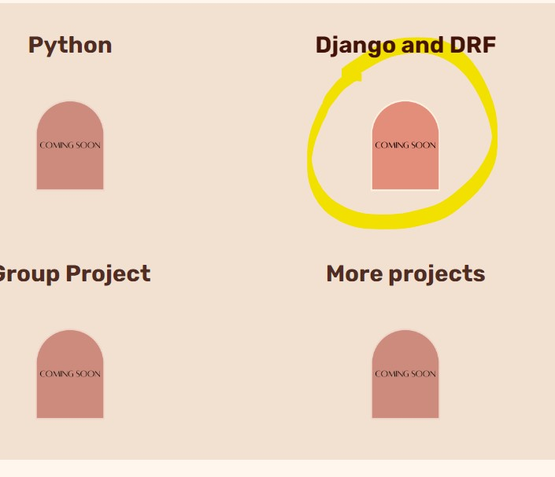

#  Kirby Thomson - Portfolio Task
​
[My portfolio site](https://kirbyalise.github.io)
​
## Project Requirements

### Content
 Add a short paragraph describing the features below. What aesthetic and technical choices did you make? 
- [x] At least one profile picture
- [x] Biography (at least 100 words)
- [x] Functional Contact Form
- [x] "Projects" section
- [x] Links to external sites, e.g. GitHub and LinkedIn.

I went for a simple blush aesthetic, making it look elegant and clean (also favourite colour pallete!) I created a contact form and added links to my Linkedin and GitHub below it. I made projects on a separate page to keep it easy to read and ​gives me space to add on more in the future to each page. 

### Technical
 Add a short paragraph describing the features below. What strategies or design decisions did you work from? 
- [x] At least 2 web pages.
- [x] Version controlled with Git
- [x] Deployed on GitHub pages.
- [x] Implements responsive design principles.
- [x] Uses semantic HTML.

I made a separate projects pages to keep my home page clean and simple with room to expand. I was only able to version control a few times due to my laptop blocking me (thanks Rio!) from pushing to GitHub. I made elements like the title, photo, contact form and projects boxes adaptive for multiple sized screens so they change size. I used semantic HTML to define different parts of my site such as header, footer and nav bar.  

### Bonus (optional)
 Add a short paragraph describing the features below, if you included any. 
- [x] Different styles for active, hover and focus states.
- [ ] Include JavaScript to add some dynamic elements to your site. (Extra tricky!)

I added in hover states for my projects boxes to change the contrast when you hover, to change the cursor when hovering over the project titles and arches and the submit button. 
​
### Screenshots

#### Desktop index.html
!

#### Desktop projects.html

#### Mobile index.html 

#### Mobile projects.html 

#### Tablet index.html

#### Tablet projects.html

#### Hover Contrast 

Note- I couldn't get screenshots of the cursors but I swear they exist!
